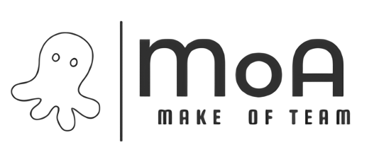

       


# MoA

### '펀딩 시스템을 도입한 프로젝트 팀 구성 서비스'

 프로젝트 명은 'MoA'로 'Make Of teAm'의 스펠링을 따서 팀을 구성한다라는 의미와 한글 발을으로는 '모아'로 모으다 라는 의미를 함축적으로 담아보았습니다.
 Icon은 여러 개의 다리로 구성된 문어가 프로젝트 팀 구성원들의 조직을 떠올린다고 생각하여 선정하게 되었습니다.


# 기획 배경

 싸피에 입과하기 전에 원하는 주제로 프로젝트를 개발해 보고 싶었지만, 혼자서 하기에는 버거웠고, 지인들로 팀을 구성하기에는 다양한 한계가 있었다. 더불어 팀을 구성하더라도 교육적으로 도움을 주며 이끌어줄 수 잇는 멘토가 필요해지게 된다는 것을 몸소 경험하게 되었다.

 이러한 문제를 겪는 소비자(학생, 취준생 등)가 많을 것이라 생각하여 프로젝트를 함께할 팀원을 모으고 멘토를 구할 수 있는 펀딩 시스템을 도입한 서비스 "MoA"(Make of teAm)를 기획하게 되었다.


# 진행프로세스

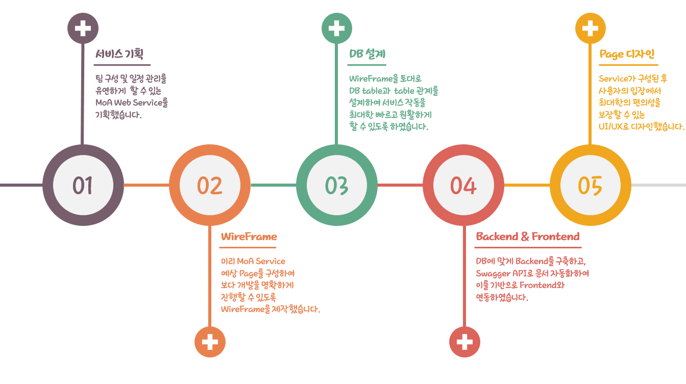


# Installation

### Front

```shell
cd frontend
npm install
npm run serve
```

- http://localhost:8080/ 에서 확인 가능

### Backend

```shell
cd backend

#window에서 실행 시
.\mvnw spring-boot:run
```

- http://localhost:8000/swagger-ui.html을 통해 swagger 확인 가능


# 배포

### Docker & Jenkins

- Docker에 Jenkins image를 만들고 Jenkins와 git을 연동하여 git commit 시 자동으로 업데이트 반영 되도록 배포

- 프론트 단과 백단에 각각 Dockerfile을 생성해 배포 설정을 저장

### Nginx & SSL

- HA와 Load Balancing을 위하여 Nginx 적용
- SSL 키를 적용하여 https 준수


 # 프로젝트 상세 소개

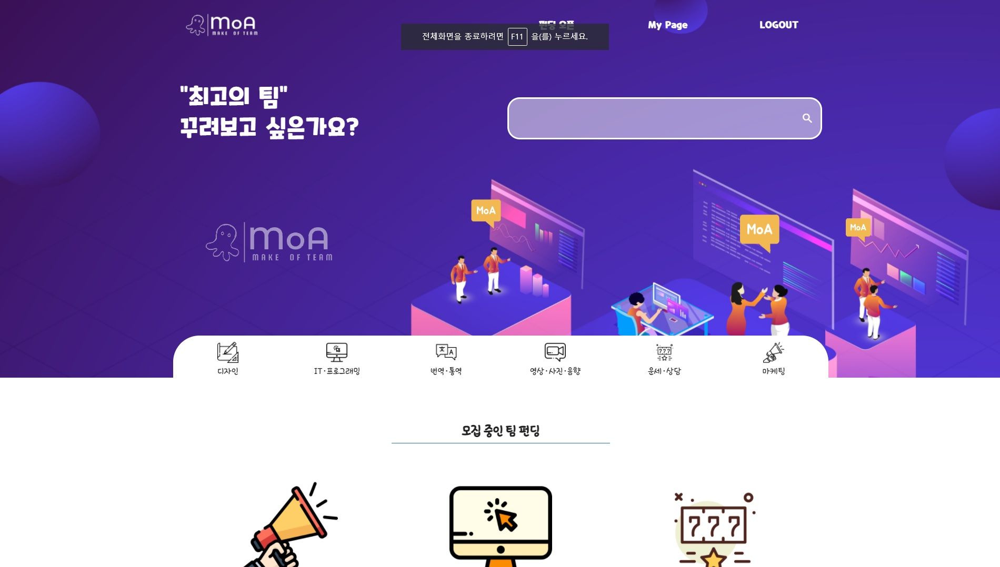

* 펀딩을 검색할 수 있으며, 모집 중인 팀 펀딩을 최신 순으로 확인 가능
* 멘토의 랭킹을 확인하여 어떤 멘토가 활발히 활동하고 있는지 확인 가능

 ### 회원가입 & 로그인

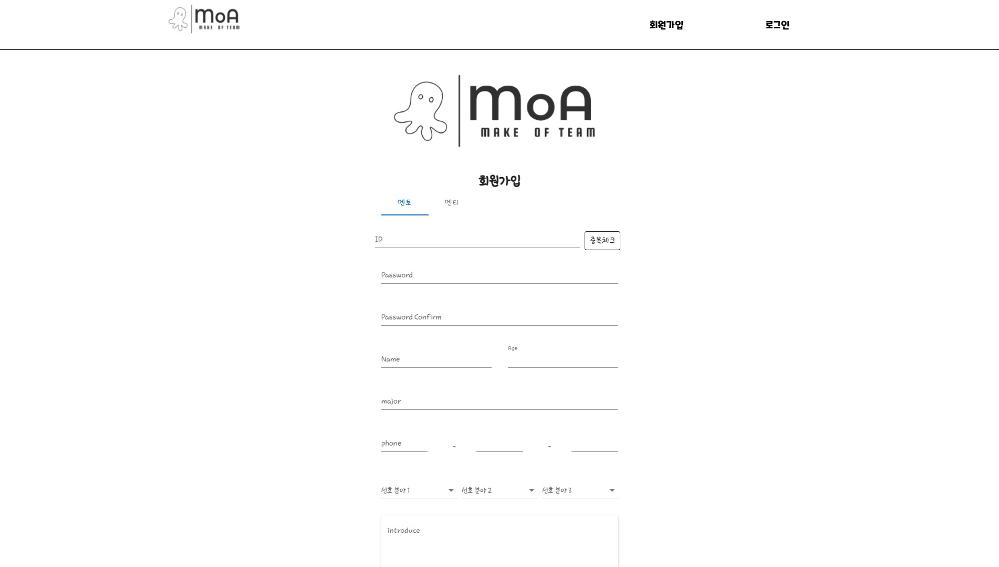

 * 멘토와 멘티를 구분한 회원가입을 진행하여 차별화된 서비스를 제공
 * 세션이 유지되는 로그인을 지원

### 마이 페이지

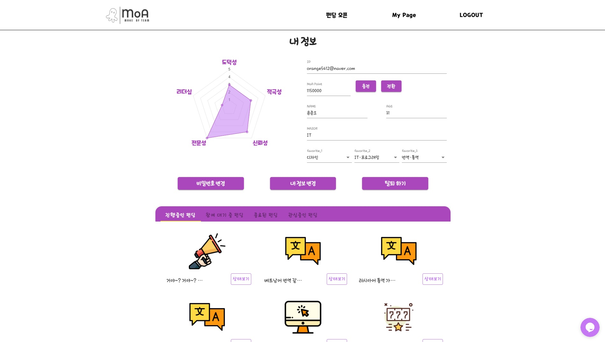

* 회원 가입 시 입력한 정보를 확인할 수 있으며, 수정 및 탈퇴 가능
* 펀딩을 관심 목록에 추가하면 마이페이지에서 확인 가능
* 종료된 펀딩을 통해 같은 팀원 및 멘토 평가 가능

### Q&A

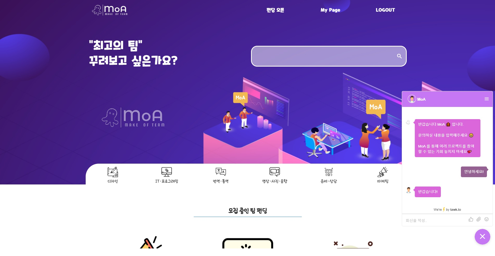

* Q&A 서비스를 통해서 MoA Web Page 사용에서 문의하고 싶은 내용 등을 문의 가능
* 하단의 채팅 서비스를 이용하여 운영자와 소통 가능

### 펀딩 서비스

##### 펀딩 오픈 페이지

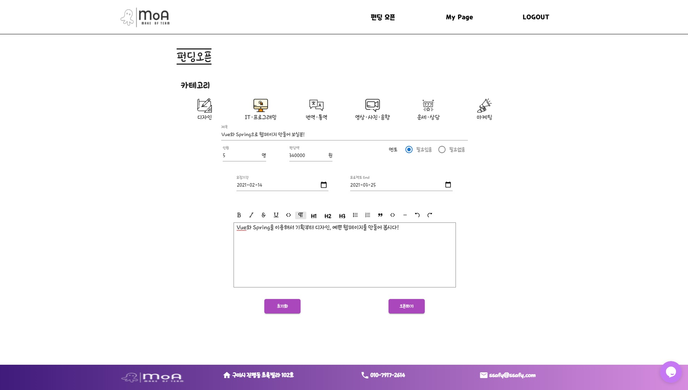

* 진행하고 싶은 프로젝트를 멘토 및 멘티가 펀딩을 열 수 있음
* 멘토 '필요없음' 체크 시 펀딩 금액은 입력할 필요 없음

##### 펀딩 디테일 페이지

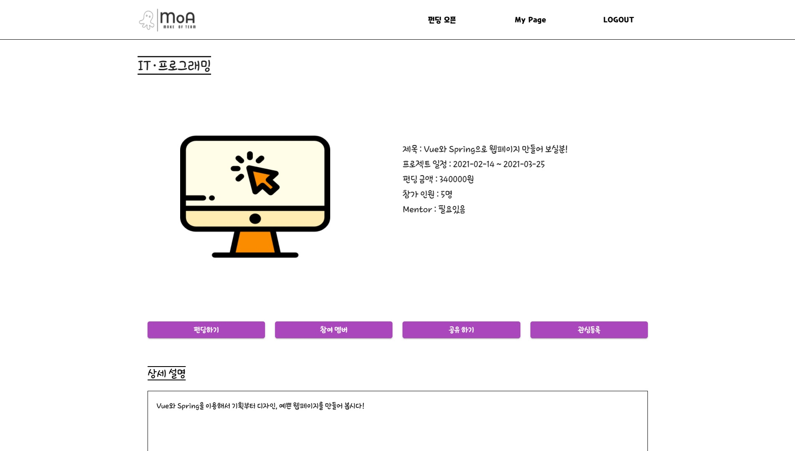

* 펀딩에 대한 디테일한 정보를 얻을 수 있음
* 관심 목록 등록이 가능하고 펀딩 참여 신청이 가능
* 공유하기를 통해 카카오톡으로 친구에게 프로젝트 정보를 공유 가능

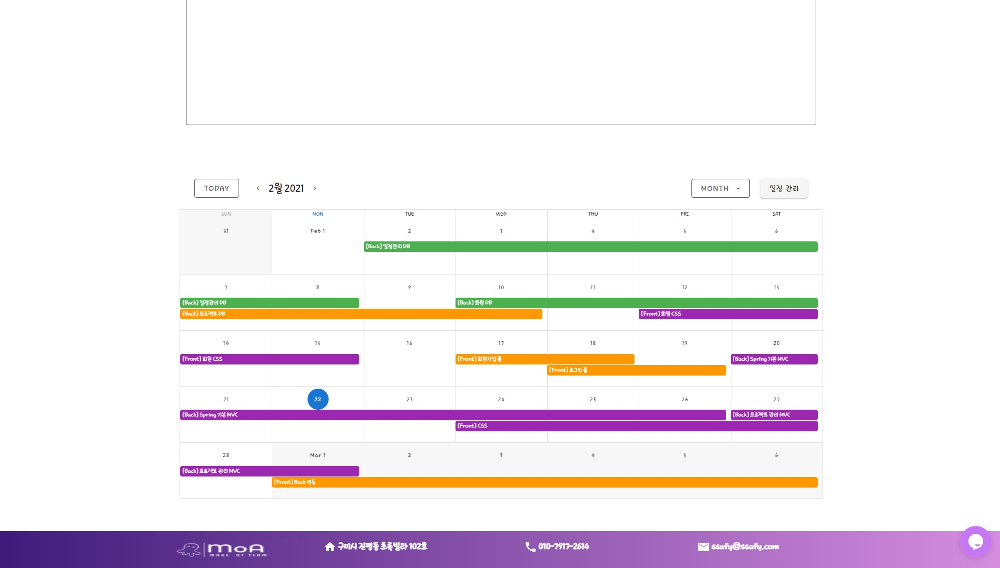

- 열린 프로젝트에 대한 상세 일정을 확인 가능

##### 펀딩 목록 페이지

-w.jpg)

- 카테고리 별로 열려있는 펀딩 목록을 확인 가능
- 관심 표시한 프로젝트의 경우 빨간색 하트를 이용하여 시각화

### 일정 관리 서비스

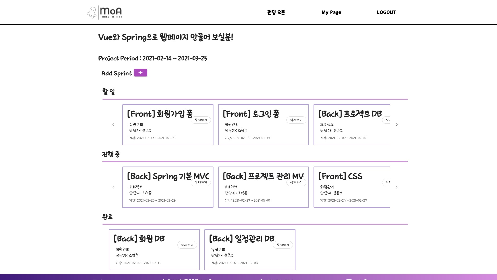

* Jira의 협업 일정 관리 서비스와 유사한 기능을 제공
* 사용에 편리한 UI/UX로 구성하여 서비스 제공
* Drag&Drop으로 편리하게 일정 이동 가능

### 멘토 및 멘티 평가 서비스

-w.jpg)

* 협조적이지 않은 팀원 및 멘토를 방지하기 위해 프로젝트 종료 후 의무적으로 평가를 통해 기록이 남도록 함
* 문제를 일으키게 되면 다른 프로젝트 참여에 문제가 될 수 있도록 함
* 반응형으로 평점을 매길 시 옆의 그래프에 바로 표현되도록 함

### 멘토 랭킹 & 멘티 능력치
* 평가를 기반으로 멘토들은 랭킹을 통해 경력을 보여줄 수 있음
* 랭킹에 따라 포인트 환급 수수료를 줄여줘 보다 열정적으로 임할 수 있게 하려는 의도
* 멘티들은 능력치를 부여 받아 성취감을 더욱 높이고자 함


# Back-end

### 파일 구조

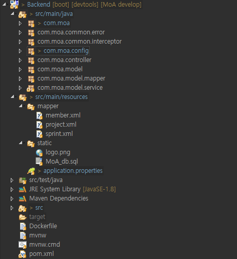

- interceptor를 통해 로그인 했을 때와 안했을 때 기능 차이를 둠
- MVC모델을 바탕으로 controller와 service, mapper, model을 구분
- myBatis를 이용하여 Database에 접근

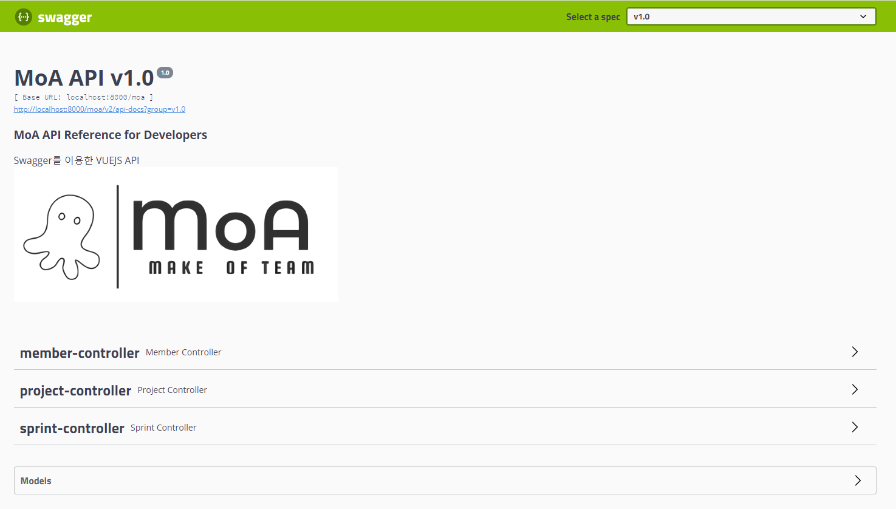

- swagger를 사용하여 API 문서를 자동화


# ER-Diagram

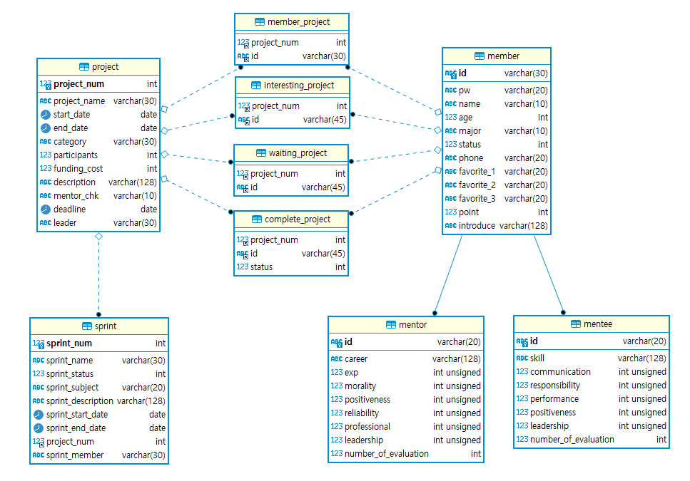


# 기술 스택

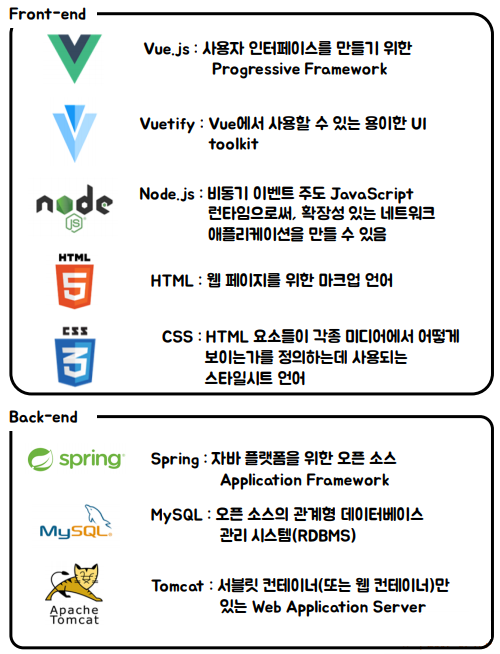


# 팀 구성원 소개

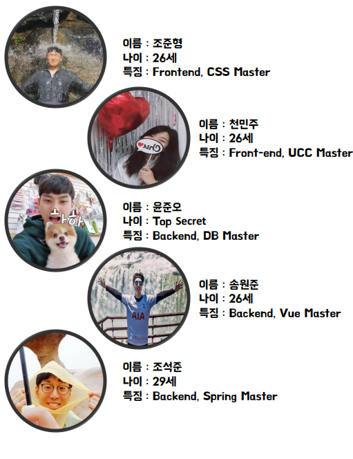